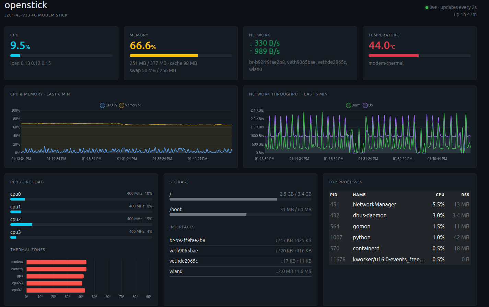

# gomon

A single-binary resource monitor for **any Linux machine** — a laptop, a
desktop, a VPS, a home server, a Raspberry Pi, or a 376 MB USB modem stick. One
static binary with the dashboard embedded in it, no runtime to install, nothing
to configure.

It is built the way it is because it started life on a **JZ01-45-V33 USB 4G
modem stick** (Qualcomm MSM8916, 4 cores @ 800 MHz, **376 MB RAM**, 3.96 GB
eMMC), where nginx + PHP + a database is a lot of machine to ask for. So `gomon`
is one **5.2 MB static binary** sitting at about **9.5 MB RSS**: no web server,
no runtime, no database, no cgo, and **no third-party Go modules** — everything
comes from the standard library.

That makes it comfortable on hardware that has nothing to spare, and it means
that on a normal PC or server it is a monitoring dashboard you will never notice
is running.



---

## Install — prebuilt

Nothing to build and nothing to install alongside it.

**x86-64 PC, server or VPS:**

```bash
curl -fsSL https://github.com/khamdan/gomon/releases/latest/download/gomon-linux-amd64.tar.gz | tar xz
sudo gomon-linux-amd64/install.sh
```

**ARM64 — Raspberry Pi, SBCs, modem sticks:**

```bash
curl -fsSL https://github.com/khamdan/gomon/releases/latest/download/gomon-linux-arm64.tar.gz | tar xz
sudo gomon-linux-arm64/install.sh
```

That drops the binary and `gomonctl` in `/usr/local/bin`, installs the systemd
unit, **enables it at boot and starts it now**, then prints the URL to open —
`http://<host-ip>:8080`.

The examples below use `gomon-linux-amd64/`; swap in `gomon-linux-arm64/` if
that is the one you downloaded.

### A different port

Pass it as the only argument:

```bash
sudo gomon-linux-amd64/install.sh 9090
```

The port is baked into the unit's `ExecStart` as it is installed, so it
survives reboots with no extra config file.

Ports **below 1024** work too. They are privileged and the service runs as
`nobody`, so the installer adds `AmbientCapabilities=CAP_NET_BIND_SERVICE` to
the unit for you — the narrow grant that allows the bind and nothing else:

```bash
sudo gomon-linux-amd64/install.sh 80
```

### Removing it

```bash
sudo gomon-linux-amd64/install.sh uninstall
```

The service runs as `nobody` with `ProtectSystem=strict`, `NoNewPrivileges`,
`RestrictAddressFamilies=AF_INET AF_INET6` and `MemoryMax=64M`. It needs no
privileges — everything it reads is world-readable and `statfs` needs no rights.

---

## What it shows

Everything is read straight from `/proc` and `/sys`, sampled every 2 seconds,
with 6 minutes of history kept in memory (180 points).

- **CPU** — total plus per-core utilisation, and each core's current MHz from
  `cpufreq/scaling_cur_freq`
- **Memory** — used / available / cache, plus swap
- **Load average**
- **Network** — per-interface rx/tx rates from `/proc/net/dev`
- **Temperature** — every zone under `/sys/class/thermal`
- **Storage** — usage per mount point via `statfs`
- **Top processes** — the 6 heaviest by CPU, from `/proc/[pid]/stat`
- **Host info** — model, kernel, uptime

The UI is Bootstrap 5.3 + Chart.js 4.4 pulled from jsDelivr, dark theme, served
from a single `//go:embed`ed `index.html`. Charts are backfilled from
`/api/history` on load, so a fresh page isn't blank. Timestamps are sent as Unix
milliseconds and rendered in the **viewer's** timezone, not the server's.

### HTTP endpoints

| path | returns |
|---|---|
| `/` | the dashboard (embedded HTML) |
| `/api/stats` | current snapshot, JSON |
| `/api/history` | the last 180 samples, JSON |

### Flags

```
-listen :8080      address to listen on
-disks /,/boot     comma-separated mount points to report
```

The shipped unit runs with `-disks /,/boot`. On a machine where `/boot` isn't
its own filesystem you'll see it twice — edit `ExecStart` in
`/etc/systemd/system/gomon.service` to whatever you actually want to watch, say
`-disks /,/home,/mnt/data`, then `sudo systemctl daemon-reload && gomonctl
restart`.

---

## Build it yourself

Go 1.21+. There is nothing to fetch.

```bash
go build -o gomon .
```

Or build the release flavour for either architecture from any machine:

```bash
# x86-64
CGO_ENABLED=0 GOOS=linux GOARCH=amd64 go build -trimpath -ldflags='-s -w' -o gomon .

# ARM64
CGO_ENABLED=0 GOOS=linux GOARCH=arm64 go build -trimpath -ldflags='-s -w' -o gomon .
```

Then install it locally, or ship it to another box:

```bash
sudo ./install.sh                                   # right here

scp gomon gomon.service gomonctl install.sh user@<host>:/tmp/gomon-dist/
ssh user@<host> 'sudo /tmp/gomon-dist/install.sh'   # somewhere else
```

`install.sh` installs whatever sits next to it, so it works the same from a
release tarball or from your own build.

Cross-compiling is worth it for small boards: on the modem stick a native build
takes about 2m40s and pushes ~41 MB into zram swap. On a PC it's a couple of
seconds either way.

### Releasing

`.github/workflows/release.yml` builds both architectures and publishes the
tarballs. Push a tag:

```bash
git tag v1.0.0 && git push --tags
```

Asset names carry no version (`gomon-linux-amd64.tar.gz`), which is what keeps
the `releases/latest/download/` URL above working forever.

Running the workflow by hand from the Actions tab is a **dry run**: it builds
both tarballs and attaches them to the run without creating a release.

---

## gomonctl

A thin wrapper over `systemctl` so you don't have to remember the unit name:

```
gomonctl start | stop | restart | status | enable | disable | logs | rebuild
```

`enable` turns on start-at-boot *and* starts it now; `disable` mirrors that.
`status` prints the URL someone on the LAN would actually type, derived from
`ip -4 -o addr`, on whatever port the installed unit says. Rather than sleeping
a fixed amount after starting, it polls `/api/stats` until the server answers —
a slow board is slow enough that a flat `sleep 1` is wrong in both directions.
`rebuild` expects the source in `~/gomon`, and is the only verb that does
nothing on a binary-only install.

---

## Requirements

- Linux, x86-64 or ARM64 (other architectures: build it yourself, the code is
  portable)
- systemd, for `install.sh` and `gomonctl` — the binary itself is happy being
  run by hand, by a supervisor, or in a container

Metrics come from ordinary `/proc` and `/sys` reads, so nothing here is tied to
a particular distro or board.
